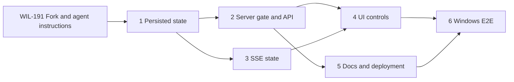

# Gaming Mode MVP implementation plan

**Status:** Ready for ticketing

**Source baseline:** `21bc145a6fa6198c4d856fbb0830845c472b0ae4`

**Design:** [`../design/gaming-mode.md`](../design/gaming-mode.md)

## Delivery strategy

Build the smallest fork-specific vertical slice while keeping llama.cpp and the
upstream router replaceable. Use real Linear dependency links and `Wave N`
labels. One issue maps to one reviewable branch/PR.

Name each branch `wil-<issue-number>-<short-slug>`. Do not use a personal
username, handle, or email identifier as a branch prefix.

## Wave 1 — state contract and fork foundations

### 1. Implement persisted Gaming Mode state

**Paths**

- Create `internal/gamingmode/state.go`
- Create `internal/gamingmode/store.go`
- Create `internal/gamingmode/state_test.go`
- Update `llama-swap.go`

**Outcome**

A concurrency-safe service stores an allowed absolute deadline, reports a stable
snapshot, expires safely, and restores state on restart. Add a startup flag for
the state-file path with an OS user-config default.

**Acceptance criteria**

- Only 60, 120, 180, or 240 minute durations are accepted.
- State-file writes use temp-file plus rename on Windows and Linux.
- Missing/expired state starts inactive; malformed persisted state fails closed
  with an actionable startup error.
- Fake-clock tests cover replace, cancel, expiry, restart, and clock movement.

## Wave 2 — server gate and API

### 2. Gate local inference and expose authenticated management API

**Blocked by:** Issue 1

**Paths**

- Update `internal/server/server.go`
- Update `internal/server/apigroup.go`
- Update `internal/server/api.go` as needed for route classification
- Create `internal/server/gaming_mode.go`
- Create `internal/server/gaming_mode_test.go`
- Update existing server/router stubs in `internal/server/*_test.go`

**Outcome**

Authenticated clients can read, activate, replace, and cancel Gaming Mode. The
server activates before calling `LocalRouter.Unload(0)` and blocks every local
load path with `503`, while peer traffic remains available.

**Acceptance criteria**

- Exact `GET`, `PUT`, and `DELETE /api/gaming-mode` contracts match the design.
- Blocked responses include structured error, `Retry-After`, and deadline.
- Local model IDs, aliases, profile pins, selectors, and `/upstream/` cannot
  bypass the gate.
- Management, UI assets, status, and peer-only requests remain reachable.
- Concurrent activation/request tests run with the Go race detector.

### 3. Stream Gaming Mode state to connected UIs

**Blocked by:** Issue 1

**Paths**

- Update `internal/server/apigroup.go`
- Update `internal/event/` only if a new typed event is required
- Update `internal/server/apigroup_test.go`

**Outcome**

The existing `/api/events` SSE stream sends an initial snapshot and subsequent
Gaming Mode changes so tabs stay synchronized.

**Acceptance criteria**

- Initial connection gets current state.
- Activate, replace, cancel, and expiry each produce a state update.
- Slow or disconnected consumers cannot block activation or expiry.

## Wave 3 — operator UI and documentation

### 4. Add Gaming Mode controls and countdown

**Blocked by:** Issues 2 and 3

**Paths**

- Update `ui/src/lib/types.ts`
- Update `ui/src/stores/api.ts`
- Create `ui/src/components/GamingModeCard.svelte`
- Update `ui/src/routes/ModelsDash.svelte`
- Add focused Vitest files next to the store/component tests

**Outcome**

The Models page shows inactive controls for 1–4 hours or, when active, an exact
countdown, deadline, and **End now** action. UI state converges through SSE.

**Acceptance criteria**

- Controls are keyboard accessible and expose loading/error state.
- Countdown derives from server deadline and browser time without per-second
  network polling.
- Active state prevents manual local load controls in the UI, while the server
  remains authoritative.
- `npm run check` and Vitest pass.

### 5. Document configuration, API, recovery, and Tailscale deployment

**Blocked by:** Issue 2

**Paths**

- Create `docs/kb/guides/operations/gaming-mode.md`
- Update `docs/wiki/api.md`
- Update `docs/wiki/architecture.md`
- Update `docs/wiki/.codewiki-state.json`
- Update `README.md` only with a short feature/deployment link if needed

**Outcome**

Operators can deploy on native Windows, use Tailscale without public exposure,
call the API, understand failure behavior, and recover from malformed state.

**Acceptance criteria**

- Guide follows `docs/kb/README.md` frontmatter rules.
- Examples use localhost plus Tailscale Serve/Tailcat and API keys.
- It states that Tailscale Funnel/public binding is not the default.
- Docs tests and internal wiki path/link validation pass.

## Wave 4 — Windows delivery evidence

### 6. Verify native Windows release and end-to-end Gaming Mode

**Blocked by:** Issues 4 and 5

**Paths**

- Update `.github/workflows/` only if existing CI lacks required Windows checks
- Add a bounded script or checklist under `scripts/` for E2E verification
- Store release evidence in the Linear issue/PR, not generated binaries in Git

**Outcome**

A native Windows amd64 binary runs llama.cpp through llama-swap, is reachable
only through the tailnet, unloads GPU models for 1–4 hours, survives restart,
and becomes available after expiry/cancel.

**Acceptance criteria**

- `make test-all`, `make test-ui`, and `make windows` succeed in a suitable CI or
  development environment.
- On the target Windows PC, process/VRAM evidence confirms unload completed.
- A tailnet client observes `503` during the window and successful inference
  after cancel/expiry.
- No public listener or Funnel exposure is present.

## Dependency graph

`WIL-191` is an operational prerequisite, not one of the six implementation
slices. It must create the verified fork and apply the approved repository
instructions before issue 1 begins.

## Verification matrix

| Risk | Evidence |
|---|---|
| Request reload race | Race-enabled concurrent server test plus process state assertion |
| Deadline lost on restart | File-backed fake-clock restart test |
| Windows file semantics | Windows CI and target-machine activation/cancel cycle |
| Gate misses a route | Table-driven local ID/alias/profile/selector/upstream tests |
| Remote access becomes public | Listener and Tailscale status/ACL evidence |
| UI drifts from server | Initial SSE snapshot plus multi-tab transition tests |
