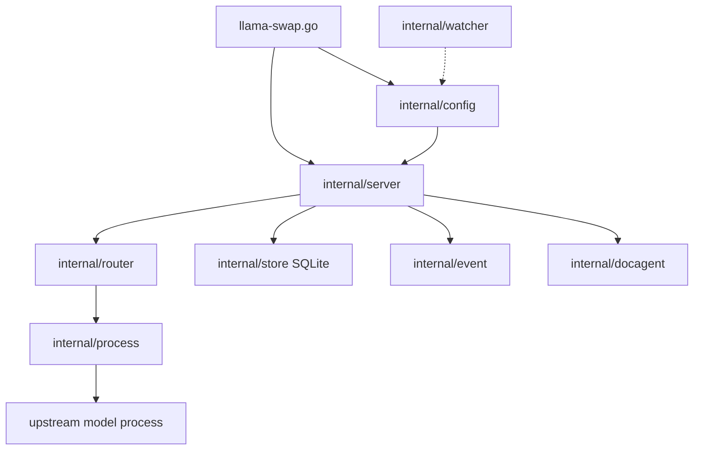

# Architecture

`llama-swap.go` is the composition root. It parses flags, loads and validates YAML through `config.LoadConfigSources`, creates log monitors, optionally creates performance monitoring and SQLite storage, then constructs `server.Server`. The server builds a local router (group or matrix) and a peer router. Requests are classified by route and dispatched to a selected local process or remote peer.

A model process is not started for every request: the router asks the process abstraction to become ready, then forwards HTTP traffic. Process output is monitored, lifecycle transitions are emitted through `event.Dispatcher`, and server middleware records request activity in `store.Store`. `watcher.Watcher` can trigger config reloads by polling file metadata.

## Components

- **CLI/composition root** — [`llama-swap.go`](../../llama-swap.go); owns startup, signals, listeners, and teardown.
- **Configuration** — [`internal/config`](../../internal/config); resolves macros, defaults, legacy routing fields, aliases, and validation.
- **HTTP server** — [`internal/server`](../../internal/server); registers endpoints, authentication, model extraction, forwarding, metrics, and MCP handling.
- **Routing** — [`internal/router`](../../internal/router); chooses group, matrix, or peer destinations.
- **Process supervision** — [`internal/process`](../../internal/process); starts, health-checks, serves, and stops upstream commands.
- **Persistence** — [`internal/store`](../../internal/store); embedded Goose migrations and SQLite activity records.
- **Events** — [`internal/event`](../../internal/event); typed subscriptions with bounded consumer queues.
- **Config watching** — [`internal/watcher`](../../internal/watcher); portable stat polling.
- **Docs agent** — [`internal/docagent`](../../internal/docagent); embedded docs and search used by server integrations.

## System flow

## Data flow

1. Flags select config file/directory and listener options ([`llama-swap.go`](../../llama-swap.go)).
2. YAML is macro-expanded, decoded, normalized, and validated ([`internal/config/load.go`](../../internal/config/load.go)).
3. `server.New` constructs local and peer routers ([`internal/server/server.go`](../../internal/server/server.go)).
4. Route handlers extract model identity and ask the router for forwarding ([`internal/server/api.go`](../../internal/server/api.go)).
5. The process waits for readiness and proxies the request ([`internal/process/process.go`](../../internal/process/process.go)).
6. Middleware/log parsing writes activity to SQLite ([`internal/store/store.go`](../../internal/store/store.go)).

## Design constraints

- Routing supports both group and matrix implementations selected by normalized config.
- Config watching is polling-based to work with bind-mounted files and projected ConfigMaps.
- The store serializes SQLite access with one maximum open connection and uses WAL for disk files.
