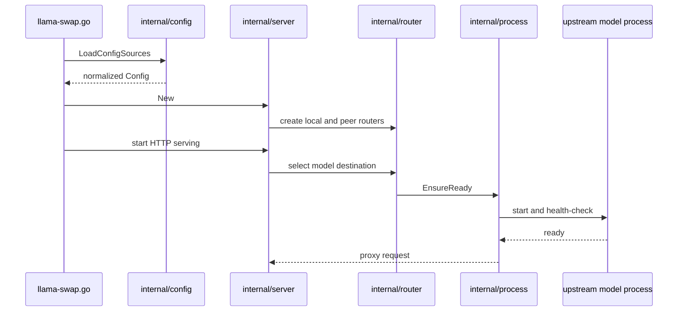
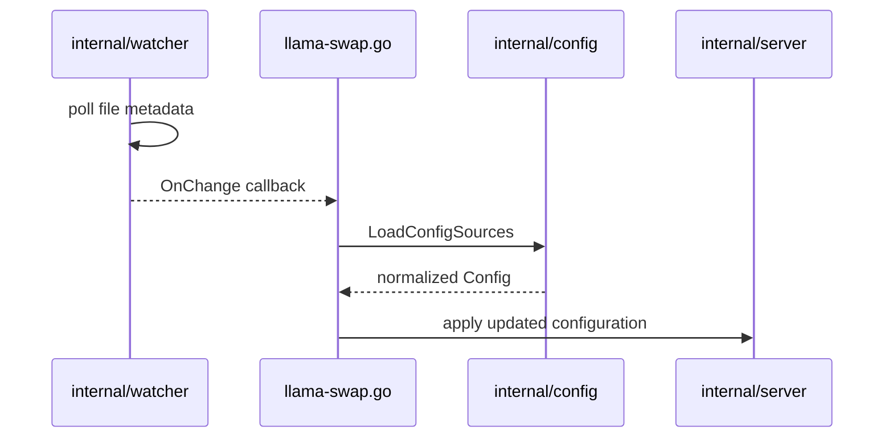
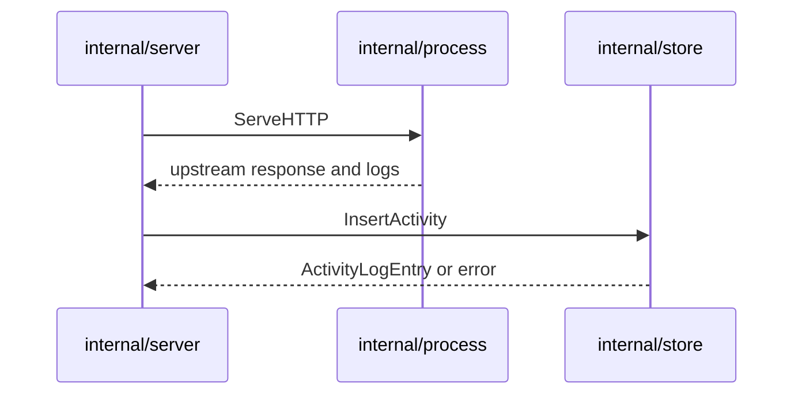

# Sequence Diagrams

## Startup and request forwarding

```mermaid
sequenceDiagram
    participant CLI as llama-swap.go
    participant Config as internal/config
    participant Server as internal/server
    participant Router as internal/router
    participant Process as internal/process
    participant Upstream as upstream model process
    CLI->>Config: LoadConfigSources
    Config-->>CLI: normalized Config
    CLI->>Server: New
    Server->>Router: create local and peer routers
    CLI->>Server: start HTTP serving
    Server->>Router: select model destination
    Router->>Process: EnsureReady
    Process->>Upstream: start and health-check
    Upstream-->>Process: ready
    Process-->>Server: proxy request
```

## Config reload

```mermaid
sequenceDiagram
    participant Watcher as internal/watcher
    participant CLI as llama-swap.go
    participant Config as internal/config
    participant Server as internal/server
    Watcher->>Watcher: poll file metadata
    Watcher-->>CLI: OnChange callback
    CLI->>Config: LoadConfigSources
    Config-->>CLI: normalized Config
    CLI->>Server: apply updated configuration
```

## Activity recording

```mermaid
sequenceDiagram
    participant Server as internal/server
    participant Process as internal/process
    participant Store as internal/store
    Server->>Process: ServeHTTP
    Process-->>Server: upstream response and logs
    Server->>Store: InsertActivity
    Store-->>Server: ActivityLogEntry or error
```
